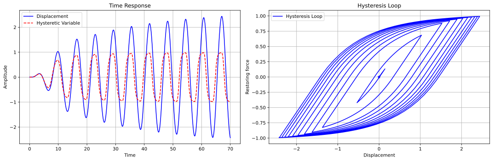
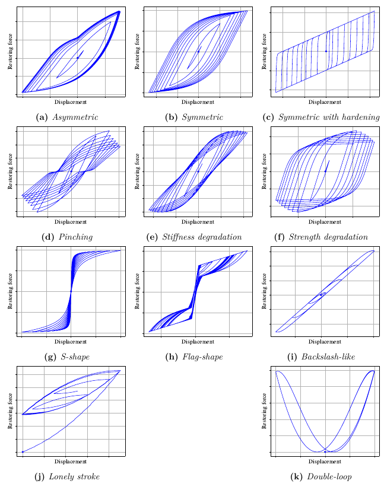
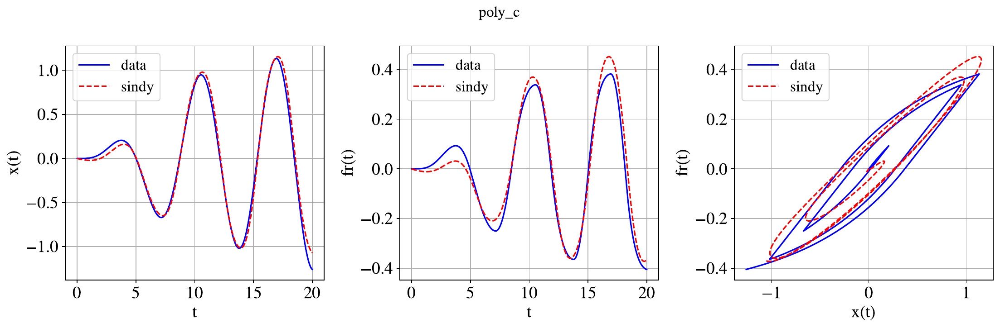
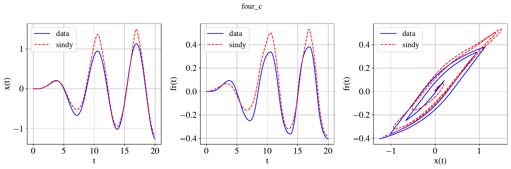
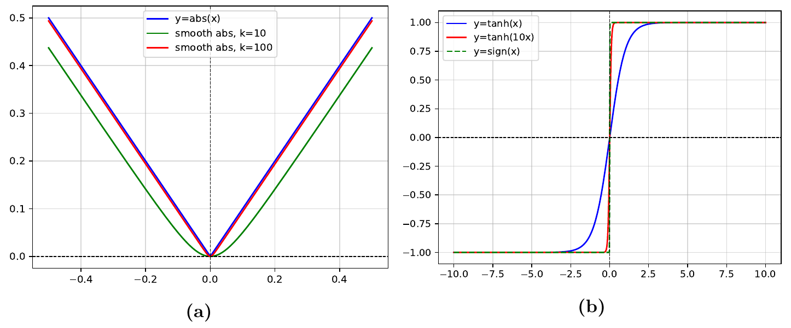
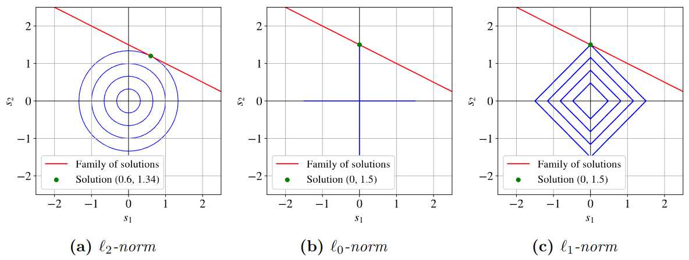
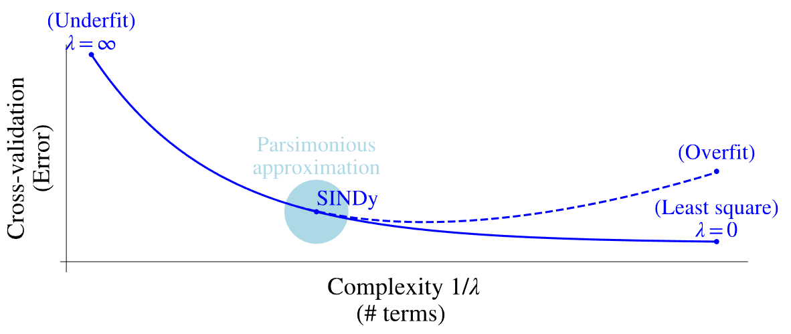

# A state-of-the-art review of the Bouc-Wen model and hysteresis characterization through sparse regression techniques

This repository contains the code used in my master thesis.

## Table of contents

1. [Auxiliary functions](#auxiliary-functions)
2. [Bouc-Wen models and hysteresis behaviors](#bouc-wen-models-and-hysteresis-behaviors)
3. [SINDy implementation](#sindy-implementation)
4. [Complementary figures](#complementary-figures)
5. [Folders structure](#folders-structure)

## Auxiliary functions

| File name                          | Description                                                                 |
|------------------------------------|-----------------------------------------------------------------------------|
| [functions.py](functions.py)       | Helper functions for plotting and data management.                         |
| [dynamics_functions.py](dynamics_functions.py) | Functions for hysteresis simulations.                                      |
| [sindy_implementation_functions.py](sindy_implementation_functions.py) | Functions for SINDy implementation in hysteresis identification.           |

## Bouc-Wen models and hysteresis Behaviors

| Model file                         | Description                                                                 |
|------------------------------------|-----------------------------------------------------------------------------|
| [bw_analysis.py](bw_analysis.py)   | Sensitivity analysis of the parameters of the standard Bouc-Wen model.      |
| [bw_fsbw_model.py](bw_fsbw_model.py)     | Flag-shape Bouc-Wen model. Simulates flag-shaped hysteresis.                |
| [bw_gbw_model.py](bw_gbw_model.py)       | Generalized Bouc-Wen model. Simulates asymmetric hysteresis.               |
| [bw_mbwbn_model.py](bw_mbwbn_model.py)   | Modified Bouc-Wen-Baber-Noori model. Simulates pinched hysteresis, stiffness degradation, and strength degradation. |
| [bw_model.py](bw_model.py)         | Standard Bouc-Wen model. Simulates symmetric hysteresis with softening/hardening. |
| [hys--backslash-like.py](hys--backslash-like.py) | Backslash-like hysteresis.                                                  |
| [hys--butterfly.py](hys--butterfly.py) | Double loop hysteresis.                                                     |
| [hys--lonely-stroke.py](hys--lonely-stroke.py) | Hysteresis with lonely-stroke.                                              |
| [hys--s-shaped.py](hys--s-shaped.py) | S-shaped hysteresis.                                                        |
| [hys--sym-deg-pinc.py](hys--sym-deg-pinc.py) | Generates figures for the modified Bouc-Wen-Baber-Noori model (mbwbn_model.py). |
| [hysteresis_plots.py](hysteresis_plots.py) | Generates all the figures with the adecaute format presented in the final document. |

## SINDy implementation

The sparse identification of nonlinear dynamics (SINDy) technique is used for hysteresis characterization. The implementation can be found in the following files:

| File name                          | Description                                                                 |
|------------------------------------|-----------------------------------------------------------------------------|
| [sindy_hys_01.py](sindy_hys_01.py) | Case 1: Exponential growth external force. Single and Composed feature library. |
| [sindy_hys_02.py](sindy_hys_02.py) | Case 2: Linear-time growth external force. Single feature library. |
| [sindy_hys_01_control.py](sindy_hys_01_control.py) | Control implementation for Case 1 (exponential growth external force).      |

## Complementary figures

The following codes are used to generate complementary figures for the thesis:

| File name                          | Description                                                                 |
|------------------------------------|-----------------------------------------------------------------------------|
| [2d_damped_oscillator.py](2d_damped_oscillator.py) | 2D damped oscillator simulation.                                           |
| [abs_smooth_approximation.py](abs_smooth_approximation.py) | Smooth approximation of the absolute value.                                |
| [pareto_front.py](pareto_front.py) | A mockup to ilustrate the Pareto curve. |
| [pnorm.py](pnorm.py)               | Plots for the l0-norm, l1-norm, and l2-norm.                               |
| [publication_trends.py](publication_trends.py) | Displays the evolution of the citations of the Bouc-Wen class model aand the SINDy algorithm across the years. |
| [sign_approx_tanh.py](sign_approx_tanh.py) | Plots the approximations used for the SINDy implementation, including smooth absolute value and sign approximations. |
| [terms_growth.py](terms_growth.py) | Presents how the increase in the order of a polynomial feature library leds to a exponential growth tendency. |

## Folders structure

The results and data used are organized into the following folders:

| Folder Name         | Description                                                                 |
|---------------------|-----------------------------------------------------------------------------|
| [data](data)            | Contains data used in the generation of hysteresis models.                  |
| [hysteresis_plots](hysteresis_plots) | Contains the plots of the different hysteretic behaviors.                  |
| [outputs](outputs)         | Contains `.txt` outputs from the SINDy implementation.                           |
| [publication_registry](publication_registry) | Contains citation data for the Bouc-Wen class model and the SINDy algorithm. |
| [publication_trends_plots](publication_trends_plots) | Contains plots showing the evolution of the Bouc-Wen class model and the SINDy algorithm over the years. |
| [results_data](results_data)    | Contains the data to create the **hysteresis_plots**, from Bouc-Wen simulations and shared data. |
| [results_plots](results_plots)   | Contains some Bouc-Wen simulations and the complementary figures. |
| [sindy_hys_01_composed](sindy_hys_01_composed) | Contains plots for SINDy simulation for Case 1 with control. |
| [sindy_hys_01_control](sindy_hys_01_control)  | Contains plots for SINDy simulation for Case 1 with composed feature libraries. |
| [sindy_hys_01_single](sindy_hys_01_single)   | Contains plots for SINDy simulation for Case 1 with single feature libraries. |
| [sindy_hys_02_single](sindy_hys_02_single)   | Contains plots for SINDy simulation for Case 2 with single feature libraries.|
| [zz_screenshots](zz_screenshots)   | Some figures to present in this README.md           |